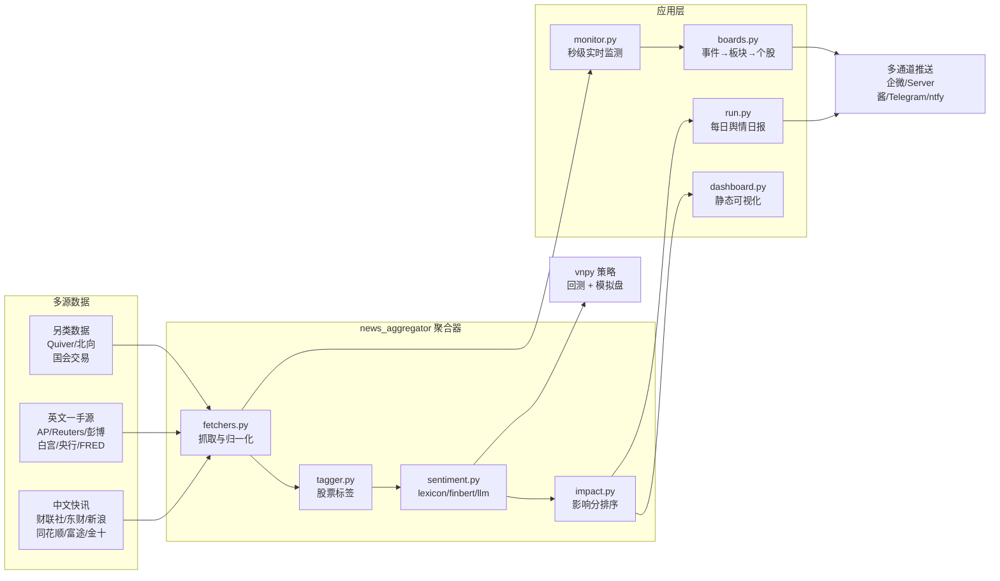

# FlashQuant 技术架构

> 本文记录项目的完整技术细节。原项目：[pipi-520/FlashQuant](https://github.com/pipi-520/FlashQuant)（MIT License）。

## 一、架构总览



## 二、核心模块

### 2.1 多源抓取（`news_aggregator/fetchers.py`）

- 归一化字段：`id, ts, date, source, title, content, url, symbols, lang, kind, ticker, politician`
- 每源独立容错：单源失败/超时不影响整体；抓取走 akshare 封装的公开端点 + Google News RSS + 官方 RSS/JSON
- 免 key 为主：仅 Quiver / Bargo / Congress / FRED（可选）/ Finnhub（回填用）需要注册，缺 key 自动跳过或降级
- 政策公告源：gov.cn 已下线 RSS，现用列表页 AJAX 数据端点 `zhengce/zuixin/ZUIXINZHENGCE.json`（旧 RSS 保留为回退）

### 2.2 情绪引擎（`news_aggregator/sentiment.py`）

可插拔后端，统一入口 `score_text` / `score_batch`，失败自动回退词典：

| 后端 | 说明 |
|---|---|
| `lexicon` | 离线中英双语词典，含否定窗口处理（`不会/没有/not/never` 等），零依赖永远可用 |
| `finbert` | `yiyanghkust/finbert-tone`，transformers 惰性加载 |
| `llm` | OpenAI 兼容 chat/completions，结构化 JSON 输出 |

### 2.3 影响分模型（`news_aggregator/impact.py`）

```
impact = w_authority × 来源权威度      # 央行/政府 1.0 → 通讯社 0.85 → 快讯 0.7~0.8
       + w_burst     × 爆发系数        # 60 分钟窗内多源相似报道计数（经校准权重降至 0.05）
       + w_intensity × 情绪强度 |score|
       + w_relevance × 标的相关度      # 有具体标的 1.0 / 无 0.2（校准后上调至 0.30）
       + w_theme     × 主题热度        # themes.yaml 中的主题权重
```

权重经 2026-08-24 校准（36939 条新闻，见 `scripts/impact_calibration.py`）：burst 对次日波动无预测力，故降权；有具体标的的新闻次日波动显著更大，故 relevance 上调。

### 2.4 事件监测（`news_aggregator/monitor.py`）

15 秒轮询常驻进程：并发抓取（线程池软超时）→ id 去重（`news/seen.json`，有界 2 万条 + 原子写入）→ 情绪打分 → 事件词匹配（`themes.yaml`）→ 影响分过滤（`impact_min`）→ 板块/个股映射（AKShare 概念板块，失败降级）→ 多通道告警。只告警不下单。

### 2.5 静态 Dashboard（`news_aggregator/dashboard.py`）

读取 `news/raw/*.jsonl` + `daily_sentiment.json` + `alerts.jsonl`，渲染为零依赖单文件 HTML（`dashboard/index.html`）：KPI、市场情绪 SVG 折线、来源/情绪分布、可过滤高影响新闻表、告警历史。由 `run.py` 每日聚合后自动重建，或 `scripts/generate_dashboard.py --watch N` 常驻刷新。

## 三、数据源清单

| 类别 | 来源 |
|---|---|
| 中文快讯 | 财联社电报 · 东财 7×24 · 新浪 7×24 · 同花顺 7×24 · 富途牛牛 · 华尔街见闻 · 金十快讯 · 政策公告（gov.cn JSON） |
| 英文一手 | AP · Reuters · AFP · 彭博（均经 Google News RSS） |
| 央行/宏观 | 美联储 · ECB · BOJ · BOE · 中国人民银行 · FRED · 非农/CPI · GDP/PCE · ISM PMI · EIA · OPEC/IEA · CFTC · VIX · AAII |
| 另类数据 | Quiver（国会/内部人交易）· 北向资金 · Bargo 国会交易 · SEC EDGAR |
| 行业 | 半导体 · 航运 BDI |
| 地缘/政策 | 白宫 · 中国外交部 · 美国国务院 · 国会听证会 · IMF/世界银行 |

## 四、量化策略

vnpy CTA 策略（`strategies/news_sentiment_strategy.py`）：T-1 日情绪分生成信号、T 日成交（前视修复）；止损/止盈/移动止损；风险预算仓位；默认只做多头。详见 [量化策略说明](../量化策略说明.md)。

研究结论（详见 `results/` 三份报告）：

- 词典情绪分与事件信号在日频层面**未通过随机对照检验**
- 短期反转因子显著（p=0.025），但对执行成本敏感，散户级成本下净收益趋零
- 新闻 α 分钟级衰减，日频聚合 + 隔日执行在架构上吃不到情绪 alpha——本项目的核心价值在**数据基础设施**而非策略本身

## 五、目录结构

```
FlashQuant/
├─ news_aggregator/          # 多源聚合 + 实时监测核心
│  ├─ fetchers.py            #   35+ 数据源抓取
│  ├─ sentiment.py           #   lexicon / finbert / llm 情绪后端
│  ├─ impact.py              #   影响分模型
│  ├─ boards.py              #   事件 → A股概念/行业板块 → 个股
│  ├─ themes.yaml            #   主题事件库（数据驱动，可扩展）
│  ├─ monitor.py             #   秒级实时监测器
│  ├─ run.py                 #   每日聚合 + 日报 + dashboard 钩子
│  ├─ dashboard.py           #   静态 Dashboard 构建器
│  └─ tagger.py / push.py    #   标签 / 多通道推送
├─ strategies/               # vnpy CTA 策略
├─ scripts/                  # 行情/情绪/回测/模拟盘/dashboard/部署脚本
├─ dashboard/                # 生成的静态页面
├─ deploy/                   # systemd / Docker 部署
├─ news/                     # 原始新闻归档 + 情绪历史（每日自动累积）
├─ docs/                     # 技术文档（本目录）
└─ config.yaml               # 统一配置
```
